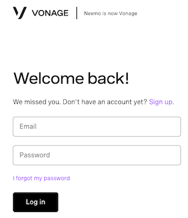
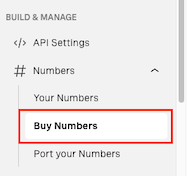
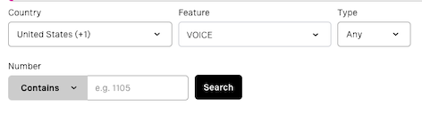
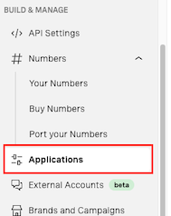
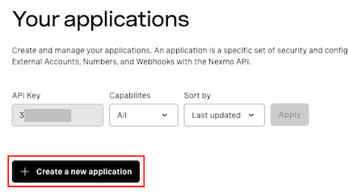
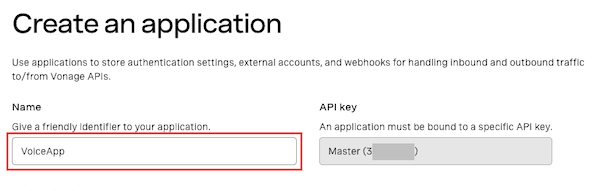
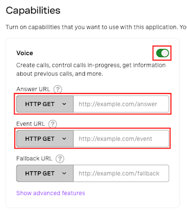
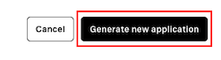
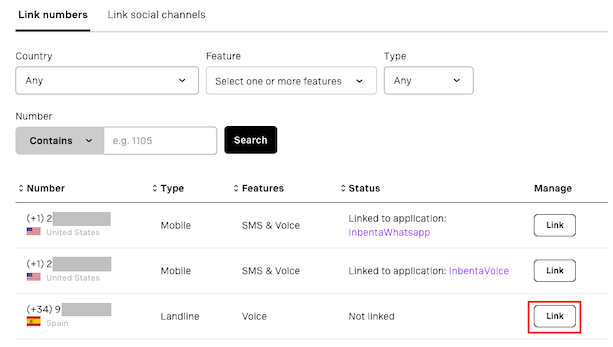
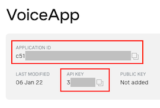

# VONAGE VOICE CHATBOT INTEGRATION

### TABLE OF CONTENTS
* [Introduction](#introduction)
* [Features](#features)
* [Building the Vonage Voice Connector](#building-the-vonage-voice-connector)
    * [Required Configuration](#required-configuration)
    * [Optional Configuration](#optional-configuration)
	* [ESCALATION (chat.php)](#escalation-chatphp)
	* [CONVERSATION (conversation.php)](#conversation-conversationphp)
	* [ENVIRONMENTS (environments.php)](#environments-environmentsphp)
	* [Deployment](#deployment)
* [Vonage Voice Configuration](#audiocodes-configuration)
    * [Account](#account)
    * [Phone number](#phone-number)
    * [Vonage Voice Application](#vonage-voice-application)
* [Prepare your Inbenta instances](#prepare-your-inbenta-instances)
    * [Text Content](#text-content)


# **Introduction**
You can extend Inbenta’s chatbot capabilities to voice with this connector to integrate with [Vonage Voice](https://dashboard.nexmo.com/).

# **Features**
The following features of Inbenta's chatbot are supported in the Vonage Voice integration:
* Answer Text.
* Sidebubble.
* Multiple options.
* Polar Questions.
* Dialogs.
* Forms, Actions & Variables (Keep in mind we are using voice as a channel. So, not all variable types work best with voice. Example: Email, Date).

# **Building the Vonage Voice Connector**

## **Required Configuration**

In your UI directory, go to **conf**. Here, you have a readme file with some structure and usage explanations.

Fill the **key** and **secret** values inside the **conf/custom/api.php** file with your Inbenta Chatbot API credentials ([Here](https://help.inbenta.com/en/general/administration/managing-credentials-for-developers/finding-your-instance-s-api-credentials/) is the documentation on how to find the key and secret from Inbenta’s backstage. Use the same credentials as backstage to access the article).

### **Optional Configuration**

There are some optional features (see the list below) that can be enabled from the configuration files. Every optional configuration file should be copied from **/conf/default** and store the custom version in **/conf/custom**. The bot will detect the customization and it will load the customized version. 


### **ESCALATION (chat.php)**

* **chat**
    * **enabled**: Enable or disable escalation (“**true**” or “**false**”).
    * **phoneNumber**: Phone number that will be used to make the transfer (e.g. ```00000000```)
    * **workTimeTableActive**: Enable or disable the active hours for escalation (“**true**” or “**false**”). If set to FALSE then transfer number is 24/7, if TRUE then we get the working hours timetable.
    * **timetable**: List of days of the week and the active hours
        * **monday**: Array with active hours. Ex. `['09:00-18:00']`
        * **tuesday**: Array with active hours. Ex. `['09:00-18:00']`
        * **wednesday**: Array with active hours. Ex. `['09:00-18:00']`
        * **thursday**: Array with active hours. Ex. `['09:00-18:00']`
        * **friday**: Array with active hours. Ex. `['09:00-18:00']`
        * **saturday**: Array with active hours. Ex. `['09:00-18:00']`
        * **sunday**: Array with active hours. Ex. `['09:00-18:00']`
        * **exceptions**: => Array with days of exceptions. Ex. `'2021-06-15' => ['9:00-12:00']`
* **triesBeforeEscalation**: Number of no-result answers in a row after the bot should escalate to an agent (if available). Numeric value, not a string. Zero means it’s disabled.
* **negativeRatingsBeforeEscalation**: Number of negative content ratings in a row after the bot should escalate to an agent (if available). Numeric value, not a string. Zero means it’s disabled.


### **CONVERSATION (conversation.php)**

*   **default:** Contains the API conversation configuration. The values are described below:
    *   **answers:**
        *   **sideBubbleAttributes:** Dynamic settings to show side-bubble content. Because there is no side-bubble in Audiocodes the content is shown after the main answer.
        *   **answerAttributes:** Dynamic settings to show as the bot answer. The default is [ "ANSWER_TEXT" ]. Setting multiple dynamic settings generates a bot answer with concatenated values with a newline character (\n).
        *   **maxOptions:** Maximum number of options returned in a multiple-choice answer.
    *   **forms**
        *   **allowUserToAbandonForm:** Whether or not a user is allowed to abandon the form after a number of consecutive failed answers. The default value is **true**.
        *   **errorRetries:** The number of times a user can fail a form field before being asked if he wants to leave the form. The default value is 3.
    *   **lang:** Language of the bot, represented by its ISO 639-1 code. Accepted values: ca, de, en, es, fr, it, ja, ko, nl, pt, zh, ru, ar, hu, eu, ro, gl, da, sv, no, tr, cs, fi, pl, el, th, id, uk
*   **user_type**: Profile identifier from the Backstage knowledge base. Minimum:0\. Default:0\. You can find your profile list in your Chatbot Instance → Settings → User Types.
*   **source**: Source identifier (default value **vonage**) used to filter the logs in the dashboards.

### **ENVIRONMENTS (environments.php)**

This file allows configuring a rule to detect the current environment for the connector, this process is made through the URL where the application is running. It can check the current **http_host** or the **script_name** in order to detect the environment.

*   **development:**
    *   **type**: Detection type: check the **http_host** (e.g. [_www.example.com_](http://www.example.com/)) or the **script_name** (e.g. _/path/to/the/connector/server.php_).
    *   **regex**: Regex to match with the detection type (e.g. “_/^dev.mydomain.com$/m_“ will set the “development” environment when the detection type is [_dev.example.com_](http://dev.example.com/)).

### **Deployment**
The Vonage Voice template must be served by a public web server in order to allow Vonage Voice to send the events to it. The environment where the template has been developed and tested has the following specifications

*   Apache 2.4
*   PHP 7.3
*   PHP Curl extension
*   Non-CPU-bound
*   The latest version of [**Composer**](https://getcomposer.org/) (Dependency Manager for PHP) to install all dependencies that Inbenta requires for the integration.
*   If the client has a **distributed infrastructure**, this means that multiple servers can manage the user session, they must adapt their SessionHandler so that the entire session is shared among all its servers.


# Vonage Voice Configuration

## Account

Log in to your Vonage account https://dashboard.nexmo.com/sign-in:




## Phone number

If you don't have any available phone number, you need to purchase one in order to link it to the voice application. Click on **Buy numbers**, on the left menu:



Search for a number depending of the country the app will be used. You need to select **VOICE** in the _Feature_ filter, and buy a desired phone number:



## Vonage Voice Application

Once you have a phone number, now it is time to create the voice application. In the left menu, click on **Applications**:



And then in the _Create a new application_ button:



Enter a name for your application:



In _Capabilities_ section, activate the **Voice** toggle. Add the next values in the inputs, with the _HTTP GET_ option selected:

* In "_Answer URL_" input, add the URL where this connector is hosted followed by "**/answer**" (Ex. _https://connector.com/answer_)
* In "_Event URL_" input, add the URL where this connector is hosted followed by "**/events**" (Ex. _https://connector.com/events_)



> "_Fallback URL_" input is not used

Click on _Generate new application_ button:



Once the application is created, click on **Link** button of the phone number you want to use:



When everything is set, copy the **Application ID** and **API Key**. You can find these values on the details of your app:



And paste these values in file **/conf/vonage.php**:

```php
return [
    'appId' => '<APPLICATION_ID>',
    'apiKey' => '<API_KEY>',
    'lang' => 'en-US' // You can choose a different language, check supported languages: https://developer.vonage.com/voice/voice-api/guides/asr#language
];
```

# Prepare your Inbenta instances

## Text Content

We should always keep in mind that user interaction is going to be through voice. 

Hence, content should be simple text: **avoid the use of HTML tags, multimedia and URLs**. This is especially important if you are using Voice template, most of the HTML tags are not recognized by the TTS (Text-To-Speech) services.

Note: “**Natural Language Search**” is the best **Transition type** for dialogs.
